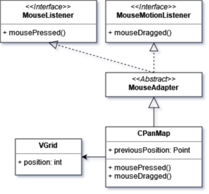

Rui CESISTA
Thibaut GUERIN
Tilmann BERLAND

*Documentations développeur et utilisateur, explications et objectif du jeu en bas du document*

### Introduction

Nous souhaitons créer un jeu de Pirates où le joueur va construire un village dans le but de recruter des
villageois pour réparer son bateau échoué.

Bienvenue à notre jeu vidéo de construction de village pirate ! Imaginez-vous naviguer sur les mers déchaînées,
à la recherche de trésors cachés et de villes à conquérir.

Au fil de votre voyage, vous rencontrez d'autres flibustiers, échangerez des ressources avec eux et construisez votre
propre cité pirate.

Il faudra aussi s'organiser pour survivre aux pirate-squelettes qui foulent votre île hantée.

---

### Analyse globale

Pour commencer, il existe des caractéristiques principales à implémenter:

* Fenêtre du jeu
    * Une fenêtre permettant de voir le jeu
* Menu principal
    * Un menu de jeu avant de commencer sa partie permettant de choisir ses paramètres
* Grille de jeu avec sa vue associée
    * Le modele du jeu en plus de son affichage
* Affichage des villageois
    * Permet a la vue d'afficher les villageois vivants

Ensuite, nous pourrons nous pencher sur:

* Contenu des tuiles
    * Ce sont les tuiles contenant des éléments comme des arbres ou des batiments
* Système de point de vie des éléments destructibles
    * Certains contenu de tuiles ont une barre de vie, l'arbre par exemple
* Déplacement des villageois
    * Les villageois se déplacent là où l'on clique
* Villageois bûcheron
    * Des villageois peuvent casser des arbres

Puis, nous allons voir:

* Selection des villageois
    * On peut selectionner les villageois grâce à un rectangle de selection
* Panneau de contrôle à droite
    * Interface permettant de voir la liste des villageois selectionnés et des informations sur les contenu des tuiles
* Système de stockage
    * On peut stocker des ressources dans un bâtiment de stockage
* Inventaire villageois
    * Les villageois peuvent porter des ressources ou des outils
* Mouvement villageois
    * Interpolation de la position du villageois lors du mouvement
* Villageois semi-autonome
    * Actions permettant aux villageois d'être automatisés à une tâche
* Vue texturée
    * Toutes les entités et tuiles ont des textures
* Actions interruptibles
    * Les villagerActions des villageois sont annulés par un nouvel ordre
* Construction des bâtiments
    * On peut construire des batiments sur des tuiles ne contenant rien
* Métiers villageois
    * Les villageois ont des métiers donc seront restreints à certaines villagerActions possibles
* Défilement
    * On peut déplacer la caméra dans le monde
* Zoom
    * Il est possible de zoomer et dézoomer la caméra
* Audio
    * Musique
    * Sons d'interaction
* Pathfinding
    * Toutes les entités trouvent le chemin le plus optimal et prennent ce chemin pour arriver à destination
    * Le chemin doit être recalculé en cas de changement
* Nouveaux villageois
    * On pourra faire apparaître de nouveaux villageois pour peupler notre village

En bonus, on pourra essayer de faire:

*Note: les fonctionalités décrites dans cette partie étaient optionelles et n'ont pas été implémentées*

* Perspective
    * Les contenus des tuiles deviennent transparent quand une unité passe derrière
* Outils
    * Outils pour accélérer le travail de nos villageois
* Attaque zombie
    * Des ennemis peuvent attaquer les villageois
* Navigation sur la mer
    * Bâteaux
* Recherche de trésors
    * On peut trouver des trésors cachés sur les îles
* Marchands ambulants
    * Des bateaux marchands arrivent pour troquer ou vendre des objets
* Coup d'état
    * Il y a différentes factions dans l'île
* Sauvegarde
    * On peut garder notre progression de jeu
* Mixité
    * On peut ajouter des variantes pour les villageois comme le genre et l'âge

---

### Analyse détaillée

##### Fenêtre du jeu

* Possibilité de redimensionner la fenêtre pour s'adapter à différentes résolutions d'écran
    * On peut redimensionner la taille de la fenêtre à notre convénience
* Boutons de contrôle pour ajuster les paramètres du jeu, tels que le volume de la musique et des effets sonores
    * On peut contrôler le volume des sons
* Internationalisation
    * Possibilité de changer la langue du jeu en fonction des préférences de l'utilisateur

#### Menu principal

* Fenetre qui se lance au démarrage pour choisir les paramètres du jeu

##### Grille de jeu avec sa vue associée

* Le monde du jeu
    * Une grille de tuiles: herbe, sable, eau
* Affichage en temps réel des changements sur la carte
    * On peut voir les changements s'opérer continuellement

#### Panneau de contrôle à droite

* Liste des tâches possibles
    * On peut voir et selectionner la tâche à faire pour les villageois
* Liste des villageois selectionnés
    * On peut voir tous les villageois selectionnés
* Affichage des attributs du villageois
    * On peut voir les attributs du villageois comme la santé, son métier

##### Affichage des villageois

* Animations pour les mouvements des villageois
    * On peut voir les différentes animations des villageois comme la marche ou couper un arbre

##### Contenu des tuiles

* Différents types de ressources et d'objets qui peuvent être collectés sur les tuilese
    * On a différents types de ressource collectable comme la nourriture, le bois et la pierre
* Différents types de tuiles
    * On a différent villagerType de tuiles qui peuvent contenir différent villagerType de ressource par exemple un
      arbre pour le bois

##### Déplacement du villageois

* Système de clic pour déplacer les villageois sur la carte
    * On a différent villagerType d'villagerAction possible pour le villageois quand on clique
* Possibilité de sélectionner plusieurs villageois et de les déplacer en groupe
    * On peut faire des villagerActions groupées, c'est-à-dire qu'on peut donner la même villagerAction à un groupe de
      villageois

##### Villageois casse arbres

* Animation pour la coupe des arbres par les villageois
    * On a une animation lorqu'un villageois coupe un arbre
* Système de progression lorsque les villageois abattent des arbres
    * Les arbres ont des PV donc ses PV descend progressivement

##### Selection des villageois

* Affichage des villageois sélectionnés
    * On pourra voir les stats, métier des villageois sélectionnés
* Possibilité de sélectionner plusieurs villageois en même temps
    * On peut donner des tâches spécifiques à plusieurs villageois en simultané

##### Système d'HP des éléments destructibles

* Affichage des points de vie
    * Les contenus des tuiles comme les arbres ont des PV
* Possibilité de réparer les bâtiments
    * On peut utiliser des ressources pour réparer les bâtiments comme les stockages

##### Système de stockage

* Différents types de bâtiments de stockage
    * On aura du stockage des différents types pour stocker différents types de ressource comme la taverne pour la
      nourriture
* Système de gestion de stock pour suivre les ressources disponibles et leur utilisation
    * On pourra voir les stocks de ressource et pourront voir ce qu'on peut faire avec

##### Inventaire villageois

* Affichage de l'inventaire de chaque villageois
    * On pourra voir les objets, ressources que le villageois a sur lui
* Possibilité de gérer l'inventaire en transférant des objets entre les villageois ou les bâtiments de stockage
    * On peut transférer les ressources entre villageois et stockage

##### Mouvement villageois

* Animation pour les mouvements des villageois, tels que la marche et la collecte de ressources
* Possibilité de configurer des points de collecte spécifiques pour les villageois

##### Villageois semi-autonome

* bûcheron
    * Les villageois bûcherons doivent être capables de détecter les arbres à proximité et aller les
      abattre pour récupérer du bois. Ils doivent également être capables de stocker le bois dans
      un endroit désigné pour une utilisation ultérieure
* constructeur
    * Les villageois constructeurs doivent être capables de construire des bâtiments
      en suivant les plans fournis par le joueur. Ils doivent être capables de collecter des ressources
      et de les transporter sur le site de construction,
      ainsi que de coordonner leur travail avec les autres villageois constructeurs
* fermier
    * Les villageois fermiers doivent être capables de cultiver des champs pour produire de la nourriture.
      Ils doivent être capables de semer les graines, de récolter les cultures et de stocker les récoltes
      pour une utilisation ultérieure
* pêcheur
    * Les villageois pêcheurs doivent être capables de pêcher dans les rivières et les lacs pour produire
      de la nourriture. Ils doivent être capables de construire des bateaux pour atteindre les zones de
      pêche et de stocker le poisson pour une utilisation ultérieure
* mineur
    * Les villageois mineurs doivent être capables d'extraire des minéraux ou de la roche
      pour produire des matériaux de construction. Ils doivent être capables de creuser des mines,
      de collecter des minéraux, roche et de stocker les minéraux, roche pour une utilisation ultérieure
* guerrier
    * Les villageois guerriers doivent être capables de défendre le village contre les attaques des ennemis.
      Ils doivent être capables de combattre avec des armes et de l'armure et de patrouiller le village
      pour détecter les menaces potentielles

##### Vue texturée

* La vue texturée doit afficher les objets du jeu avec des textures graphiques plutôt que des formes simples et des
  couleurs unies
    * Tout l'objet, unité, tuiles sont texturées
* Les textures doivent être réalistes, cohérentes avec l'environnement du jeu
    * Les textures sont en rapport avec le jeu
* Les textures doivent être optimisées pour les performances, afin de ne pas ralentir le jeu
    * Les textures ne gène pas au jeu

##### Actions interruptibles

* Les villagerActions des villageois doivent être interruptibles par le joueur, afin de permettre une gestion efficace
  de leur
  temps et de leurs ressources
* Les villagerActions doivent être facilement interrompues à tout moment, sans causer de confusion ou de désorientation
  au
  joueur.
* Les villageois doivent être capables de reprendre leur villagerAction interrompue à tout moment, sans perdre de temps
  ou
  d'énergie

##### Construction des bâtiments

* Les bâtiments doivent être construits à partir de plans fournis par le joueur
    * Tous les bâtiments a besoin d'un certain nombre de ressources pour être construit
* Les plans doivent inclure des informations sur les matériaux nécessaires à la construction, ainsi que sur les coûts et
  le temps(?) de construction
    * On affichera les couts en ressources des bâtiments
* Les villageois doivent être capables de collecter les matériaux nécessaires et de les transporter sur le site de
  construction
    * La construction des bâtiments se fait de façon autonome

##### Pathfinding

* Système de recherche de chemin pour les villageois et les enemis
* Utilisation d'algorithmes de pathfinding (par exemple, A*, Dijkstra, etc.)
* Gestion des obstacles et des zones inaccessibles sur la grille de jeu
* Mise à jour dynamique des chemins en fonction des obstacles sur la grille de jeu

##### Métiers villageois

* Définition de différents métiers pour les villageois
    * On peut voir les descriptions des différents métiers
* Possibilité de changer le métier d'un villageois en cours de partie ?
* Système de compétences et de niveaux pour chaque métier ?
* Ressources et outils nécessaires pour chaque métier
    * On a besoin de certains outils pour faire des métiers

##### Nouveaux villageois

* Ajout de nouveaux villageois en cours de partie
    * On peut obtenir de nouveaux villageois via la naissance de bébé, l'arrivée de nouveau pirate.
    * On peut aussi le faire via bâtiments spéciaux
* Gestion des caractéristiques de chaque nouveau villageois
    * On pourra choisir les nouveaux métiers des villageois et prendre leurs ressources

##### Défilement

* Il est possible de bouger la caméra pour voir certaines zones du monde

##### Zoom

* Il est possible de zoomer et dézoomer la caméra

##### Audio

* Il y a de la musique qui convient à l'ambiance du jeu
* Il y a des sons qui jouent lorsqu'on interagit avec l'interface ou lors d'événements spéciaux

### Fonctionnalités optionelles
*Non implémentées au final*

##### Perspective

* Les bâtiments doivent être transparents lorsqu'un villageois/ennemi est derrière
    * On peut voir les unités derrière les bâtiments

##### Outils

* Ajout d'outils pour les villageois
    * On a différent villagerType d'outils pour faire différentes villagerActions
* Système de fabrication d'outils
    * On pourra fabriquer des outils à partir de certains bâtiments et ressources
* Effets spécifiques pour chaque outil
    * Action possible pour chaque outil

##### Attaque zombie

* Création de zombies
* Déplacement des zombies
* Interaction des zombies avec les villageois
* Système de santé pour les zombies
* Interface utilisateur pour afficher les informations sur les zombies

##### Navigation sur la mer

* Création de bateaux
* Déplacement des bateaux
* Interaction des bateaux avec l'environnement
* Système de santé pour les bateaux
* Interface utilisateur pour afficher les informations sur les bateaux
* Combats de navires sur la mer contre des bâteaux fantôme ou autres navires
* Abordage des navires ennemis

##### Recherche de trésors

* Création de cartes aux trésors
* Placement de trésors sur l'île
* Interaction des villageois avec les trésors

##### Marchands ambulants

* Création de marchands ambulants
* Déplacement des marchands ambulants sur la carte
* Interaction des villageois avec les marchands ambulants
* Vente et achat d'articles entre les villageois et les marchands ambulants
* Interface utilisateur pour afficher les informations sur les marchands ambulants et les articles disponibles à l'achat

##### Coup d'état

* Création de factions de villageois
* Déclenchement de l'insurrection
* Combat entre les factions de villageois
* Détermination du vainqueur
* Interface utilisateur pour afficher les informations sur l'insurrection et les factions de villageois

##### Sauvegarde

* Enregistrement de l'état actuel du jeu
* Chargement d'une partie enregistrée précédemment
* Interface utilisateur pour la sauvegarde et le chargement des parties

##### Mixité

* Textures alternatives: femmes, personnes agées, enfants...
* Statistiques aléatoires ou dépendant de l'age par exemple

---

### Plan de développement

| Tâche                                                                           | Début    | Durée | Dev              |
|---------------------------------------------------------------------------------|----------|-------|------------------|
| Conception intro                                                                | 30/01/23 | 90    | Tous             |
| MVC: Fenêtre, Grille, Pirate                                                    | 30/01/23 | 40    | Tilmann          |
| Modèle Case fractionné                                                          | 31/01/23 | 30    | Thibaut          |
| Déplacement pirate                                                              | 01/02/23 | 15    | Tilmann          |
| Drag selection (Vue)                                                            | 01/02/23 | 45    | Tilmann          |
| Casser arbres                                                                   | 02/02/23 | 15    | Tilmann          |
| Refactors                                                                       | 02/02/23 | 60    | Tous             |
| Controlleur villageois basique                                                  | 03/02/23 | 90    | Thibaut          |
| Points de vie des contenus des cases                                            | 04/02/23 | 15    | Rui              |
| Storage system                                                                  | 04/02/23 | 30    | Rui              |
| Gros refactor                                                                   | 04/02/23 | 50    | Tilmann          |
| Interpolation mouvement                                                         | 05/02/23 | 45    | Thibaut          |
| Resources                                                                       | 05/02/23 | 30    | Rui              |
| Rectangle de sélection de villageois                                            | 05/02/23 | 20    | Tilmann          |
| Villageois autonome (déforestation)                                             | 05/02/23 | 80    | Thibaut          |
| Système de construction                                                         | 06/02/23 | 30    | Rui              |
| Travail sur le rapport                                                          | 06/02/23 | 30    | Tous             |
| Added sprites                                                                   | 07/02/23 | 50    | Tilmann          |
| Destructible cell contents                                                      | 12/02/23 | 10    | Tilmann          |
| Classes Position et Inventory                                                   | 12/02/23 | 40    | Tilmann          |
| Thread de raffraîchissement                                                     | 12/02/23 | 10    | Tilmann          |
| Menu principal                                                                  | 12/02/23 | 20    | Tilmann          |
| Travail sur le rapport                                                          | 13/02/23 | 10    | Tous             |
| No pixels in model, cellsize instead                                            | 13/02/23 | 20    | Tilmann          |
| Défilement de la carte                                                          | 13/02/23 | 40    | Tilmann          |
| Système de crafting                                                             | 14/02/23 | 30    | Rui              |
| Système de zoom                                                                 | 16/02/23 | 50    | Tilmann          |
| Musique aléatoire en boucle                                                     | 16/02/23 | 30    | Tilmann, Thibaut |
| Travail sur le rapport                                                          | 25/02/23 | 40    | Rui              |
| Travail sur le rapport                                                          | 26/02/23 | 20    | Tilmann          |
| Fenêtre redimensionnable                                                        | 26/02/23 | 30    | Tilmann          |
| Classe Village contenant les bâtiments                                          | 01/03/23 | 20    | Thibaut          |
| Refactors                                                                       | 02/03/23 | 25    | Tilmann          |
| Informations sur la case selectionnée                                           | 04/03/23 | 30    | Rui              |
| Liste des villageois à droite                                                   | 06/03/23 | 20    | Tilmann          |
| Ennemis qui attaquent les villageois                                            | 06/03/23 | 40    | Rui              |
| Travail rapport analyse globale                                                 | 11/03/23 | 20    | Rui              |
| Travail rapport analyse globale                                                 | 11/03/23 | 50    | Tilmann          |
| Fond d’écran du menu                                                            | 11/03/23 | 45    | Tilmann          |
| Villageois bougent quand ils font rien (idle)                                   | 13/03/23 | 10    | Tous             |
| Nouvelles textures pour les villageois                                          | 13/03/23 | 20    | Tilmann          |
| Pousse des arbres                                                               | 13/03/23 | 15    | Rui              |
| Added pathfinding with A*                                                       | 18/03/23 | 70    | Rui              |
| Panneaux de droite séparés                                                      | 20/03/23 | 20    | Tilmann          |
| Tombes qui font apparaître des ennemis                                          | 20/03/23 | 40    | Rui              |
| Taille de la carte en paramètre du jeu                                          | 20/03/23 | 15    | Tilmann          |
| Affichage des inventaires des bâtiments dans le panneau                         | 20/03/23 | 20    | Tilmann          |
| Interface Container pour les classes contenant des ressources                   | 20/03/23 | 40    | Thibaut          |
| Chaque type de villageois a des attributs différents                            | 24/03/23 | 20    | Tilmann          |
| Maisons qui font apparaître de nouveaux villageois                              | 25/03/23 | 20    | Rui              |
| Zoom centré sur la position de la souris                                        | 25/03/23 | 25    | Thibaut          |
| Diagonales sur A*                                                               | 25/03/23 | 15    | Thibaut          |
| Icônes d’action et sprites des autres villageois                                | 26/03/23 | 35    | Tilmann          |
| Pas de cells dans A* mais des points                                            | 26/03/23 | 20    | Tilmann          |
| Ajout de ligne de vision pour ne pas déplacer en escalier (Theta*)              | 26/03/23 | 40    | Tilmann          |
| Fix pathfinding bugs                                                            | 26/03/23 | 30    | Tilmann, Rui     |
| Le fermier peut planter des arbres et enlever les troncs                        | 26/03/23 | 35    | Rui              |
| Début boutons d’action sur l’interface                                          | 26/03/23 | 30    | Tilmann          |
| Travail sur le rapport                                                          | 27/03/23 | 40    | Tous             |
| Déplace la caméra sur le villageois cliqué dans la liste                        | 27/03/23 | 15    | Tilmann          |
| Travail rapport conception détaillée Thread manager                             | 27/03/23 | 25    | Thibaut          |
| Déplace la caméra de manière lisse                                              | 27/03/23 | 35    | Tilmann          |
| Selection des villageois dans la liste                                          | 28/03/23 | 15    | Tilmann          |
| Défilement dans la liste des villageois                                         | 28/03/23 | 35    | Tilmann          |
| Défilement lisse de la liste                                                    | 28/03/23 | 30    | Tilmann          |
| Boutons construire bâtiments                                                    | 02/04/23 | 20    | Tilmann          |
| Textures pour l’épave et pour l’herbe dans différentes saisons                  | 02/04/23 | 25    | Tilmann          |
| Calendrier pour les jours qui passent                                           | 02/04/23 | 30    | Thibaut          |
| Ajout de saisons pour l’esthétique                                              | 02/04/23 | 10    | Tilmann          |
| Affichage nombre de jours                                                       | 02/04/23 | 15    | Tilmann          |
| Équilibrage du jeu                                                              | 02/04/23 | 10    | Thibaut          |
| Ajout de l’épave                                                                | 02/04/23 | 20    | Thibaut          |
| Travail sur rapport                                                             | 03/04/23 | 10    | Rui              |
| Réparation de l’épave                                                           | 03/04/23 | 30    | Thibaut          |
| Affichage barre de réparation de l’épave                                        | 03/04/23 | 15    | Tilmann          |
| Plus d’icônes d’actions et texture arbres poussant pour les différentes saisons | 03/04/23 | 20    | Tilmann          |
| Ajout du fichier jar et Images dans le buffer                                   | 06/04/23 | 20    | Tilmann          |
| Travail rapport                                                                 | 06/04/23 | 25    | Tilmann          |
| Ajout de la documentation qui manquait                                          | 06/04/23 | 30    | Tilmann          |
| Amélioration du système de combat et équilibrage                                | 06/04/23 | 40    | Thibaut          |
| Travail sur le rapport                                                          | 06/04/23 | 15    | Tilmann          |
| Ajout des temps de travail au diagramme de gantt                                | 07/04/23 | 50    | Tilmann          |
| Ajout de tout jusqu’à maintenant au diagramme de gantt                          | 08/04/23 | 130   | Tilmann          |
| Fix Theta*                                                                      | 08/04/23 | 30    | Tilmann          |
| Fin du rapport                                                                  | 09/04/23 | 300   | Thibaut, Tilmann |

---

### Conception générale

La structure du projet est en MVC (Model-View-Controler):

Le modèle contient:

* La grille de cases
* Les villageois
* La selection des villageois

La vue va s'occuper de dessiner les éléments de la grille,
les villageois et le panneau de contrôle.

Et enfin, le controlleur va mettre à jour le modèle:
on peut séléctionner les villageois,
puis leur donner un ordre avec le panneau de droite.

#### Villageois

Les villageois ont un type (bûcheron, fermier, etc.):

Ces différents types de villageois peuvent faire des actions différentes
par exemple le captain et le bûcheron peuvent se défendre contre les ennemis
et casser les arbres et laissent le tronc de l'arbre.

---

### Conception détaillée

#### Grille

La grille est un tableau 2D de cases, chaque case a un enum CellGround pour le sol (herbe, eau, sable, etc.) et un contenu CellContent (bâtiment, arbre, etc.).

#### Case

Une case est définie par une position, un sol et un contenu. Si son contenu est un bâtiment, elle peut aussi faire partie d'un village.

#### Génération de la grille

Malheureusement, nous n'avons pas eu le temps de faire une génération procédurale de la grille.
Nous avons donc fait une grille avec un disque d'herbe au centre, du sable autour et de l'eau à l'extérieur.

Pour cela, nous avons utilisé l'équation paramétrique d'un cercle:

x2 + y2 = r2

Dans la classe CellGrid, on appelle randomCell() sur chaque case.
Cette méthode met le sol de la case à herbe, sable ou eau en fonction de sa position.
Par exemple, si x2 + y2 < 100, alors la case est de l'herbe.
(PS: nous n'utilisons pas sqrt(100) mais des fractions des dimensions de la grille pour que la taille de l'île soit proportionnelle à la taille de la grille).

Après avoir donné un sol à chaque case, on décide de quel contenu il va avoir.
Si le sol est de l'herbe, on peut avoir un arbre avec 20% de chance et un rocher avec 10% de chance.
Si le sol est du sable, on peut avoir des tombes (on verra ça plus tard).
Sinon c'est de l'eau, donc on ne met pas de contenu.

#### Modèle Village

Tous les bâtiments faisant partie du village sont ajoutés à ce modèle lors de leur construction.

Cela permet aux villageois de rapidement trouver un bâtiment du village respectant un certain prédicat, tel que la fonction `findNonFullStorage` qui permet de trouver le stockage non plein le plus proche.

Bien que cette possibilité n'ait pas été utilisée, ce modèle pourrait aussi permettre de montrer à l'utilisateur des statistiques agrégées sur son village, tel que le nombre de bâtiments d'un certain type, le nombre total de bois dans les stockages du village, ou le nombre totale de place libre dans les stockages du village.

Toutes les fonctions:

- `findNonFullStorage` pour trouver un stockage pas plein
- `findStorageWith` pour trouver un stockage contenant une certaine ressource
- `findNearest` pour trouver un bâtiment d'un certain type
  - la variante prenant aussi un prédicat, utilisée par toutes les autres foncitons, est privée pour ne pas exposer trop de complexité aux autres classes

Toutes ces fonctions sont utlisées largement dans le système de contrôle des villageois (voir section "VillagerManager"). Elles retournent toutes la case sur laquelle se trouve le bâtiment le plus proche correspondant à ce qui est demandé.

#### Villageois

Le type des villageois est défini par l'enum VillagerType.

Toutes ses actions possibles sont définis dans l'enum VillagerActions.
Chaque type de villageois a sa liste d'actions autorisées.

De plus, ils ont un manager qui va s'occuper de leur déplacement et de leurs actions (voir section "VillagerManager").
Ils ont un inventaire qui contient les ressources qu'ils ont collecté.
Ils ont aussi une position interpolée pour le déplacement (voir section "Déplacement").

#### Spawn des villageois

Lorsqu'une maison est construite, un thread lui est associé de manière temporaire qui fera apparaître jusqu'à trois villageois sur sa case, à un intervalle de temps entre 5 et 10 secondes. Leur métier est choisi aléatoirement entre bucheron et fermier.

#### Spawn des ennemis

Lors de la création du terrain, des tombes sont placées aléatoirement dans la zone de sable.

Chaque tombe est associée à un thread qui fera apparaître des ennemis sur sa case comme suit:

- au début du jeu, attendre deux jours avant de faire apparaître des ennemis
- des jours 3 à 10, faire apparaître des ennemis à un intervalle de plus en plus rapide, calsulé à partir du jour actuel dans le jeu, avec un cap global de 20 ennemis à tout instant
- après le jour 10, faire apparaître des ennemis en continu avec un cap de 200

#### Gestionnaire de threading des villageois
(aka. VillagerManager, système de contrôle)

Pour le threading des villageois, nous avons choisi d'utiliser un système à grand pas afin d'avoir un code plus naturel (cela nous a permis d'ajouter facilement et rapidement de nouvelles actions dans ce système de contrôle), et pour éviter un dégradation inutile des performances.

Un gestionnaire de threading (détaillé ci-dessous) a été mis en place pour premettre l'interruption propre et instantanée d'une action, ce qui nous permet de donner des ordres de manière instantanée aux villageois même si une action est en cours. 

Le système à grands pas a cependant posé des difficultés pour l'interaction entre les villageois et les ennemis.

Afin de gérer le threading des villageois, une classe TM (pour Thread Manager) a été crée. Elle contient des fonctions statiques destinées à gérer les thread:
- `TM.sleep(int, Runnable)` prend un temps de pause en millisecondes et une lambda-fonction devant être exécutée en cas d'interruption
- `TM.check(boolean)` interrompt l'action actuelle comme un échec si l'argument est faux
- `TM.runFail(Runnable, Runnable, Runnable)` prend 3 lamba fonctions: la première doit être exécutée de suite, la seconde doit être exécutée en cas d'interruption pour échec, la troisième doit être exécutée en cas d'interruption classique

Pour gérer les interruptions et les échecs, les fonctions de la classe TM s'occupent d'attrapper et de faire remonter les exceptions Interrupted et Exited comme approprié:

- `TM.sleep` attrappe InterruptedException, exécute son second argument et renvoie Interrupted (cette exception est aussi renvoyée avant immédiatement si `Thread.interrupted()` est vrai)
- `TM.check` envoie Exited quand son argument est faux
- `TM.runFail` attrappe Interrupted, exécute son troisième argument et renvoie Interrupted en cas d'interruption, ou attrappe Exited et exécute son second argument en cas d'échec

#### VillagerManager et système de combat

Les villageois et les ennemis disposent respectivement de classes `VillagerManager` et `EnnemyManager` étandant la classe de base `UnitManager`.

Ces classes implémentant un système de contrôle à grands as pour les unités. Un ordre peut être donné aux villageois grâce à la fonction `setMode`, qui interrompt l'action en cours grâce au système de threading et déclenche l'action suivante.

Dans le cas des ennemis, l'algorithme qui est exécuté en permanance est de bouger de manière aléatoire, regarder s'il y a des villageois dans les environs, et, le cas échéant, de les attaquer.

Pour les villageois, de nombreuses fontions sont dispoibles pour implémenter leurs actions semi-automatiques, comme le fait de couper du bois et le ranger dans un stockage. L'algorithme principal consiste à boucler en permanence pour exécuter l'ordre qui a été reçu. Quand cet ordre se termine (que ce soit car la fonction return ou par l'exception `TM.Exited`), le villageois repasse en mode idle, ou il se déplace aléatoirement.

Lorsqu'un ennemi attaque un villageois, un message est envoyé au villageois, qui reçoit alors l'ordre d'interrompre son action actuelle pour se défendre (ou paniquer si le villageois n'est pas armé). Le villageois reprendra son action précédente une fois l'ennemi éliminé. Avant de reprendre son action, s'il lui reste moins de la moitié de sa vie, le villageois ira d'abord se reposer à la taverne pour regagner sa via, s'il existe uen taverne dans le village.

#### Interpolation du déplacement

Afin d'avoir un déplacement régulier et toujours parfaitement synchronisé avec l'écran, et dans le cadre de notre système de contrôle à grands pas, nous avons choisi d'utiliser un système d'interpolation pour modéliser le déplacement des villageois. C'est la classe `Position` qui se charge de gérer la position de toutes les unités (chaque unité a sa propre instance).

Lorsqu'on veut faire se déplacer une unité, on apelle la fonction `Position.move(x, y)`, qui enregistre l'heure de démarrage du déplacement (`System.currentTimeMillis`), calcule la vitesse de l'unité dans les directions x et y en fonction de sa vitesse de base, et marque l'unité comme étant en cours de déplacement. Cette fonction renvoie aussi le temps avant d'atteindre la destination, en millisecondes.

Lorsque les fonctions `getX` et `getY` sont appelées, elles renvoient la position statique de l'unité si elle n'est pas en mouvement, ou interpolent sa position actuelle à partir de sa position de départ, l'horloge du système, et les paramètres définis ci-dessus.

Il est important de noter que la classe `Position` ne fait aucun tests pour arrêter le villageois lorsqu'il a atteint son objectif. À la place, c'est le thread qui a lancé le mouvement qui doit l'arrêter après le temps indiqué avec la fonction `Position.finishMoving(x, y)`. En pratique, tout cela est géré par la fonction `Unit.moveTo(x, y)`, et les autres classes ne sont pas censées utiliser directement les fonctions de la classe `Position`. Cette fonction s'occupe aussi de stopper le mouvement grâce au gestionnaire de threading (voir section threading) en cas d'interruption.

La raison pour laquelle la classe `Position` ne fait aucun test sur l'arrivée est que, étant donné que le thread ayant appelé le mouvement doit dans tous les cas sleep jusqu'à la fin du mouvement, cela faisait plus de sens en termes de performances de laisser ce thread arrêter ensuite le mouvement.

#### Les arbres

Le farmer peut déraciner les troncs d'arbre et planter les arbres.
Pour ce faire il cherche le tronc d'arbre le plus proche avec la fonction nearestCell(Tronc)
Il se déplace avec la fonction moveTo sur le tronc puis il sleep avec TM.sleep puis on met sa cellContent
à null.

En terme de la croissance des arbres on l'a divisé en 3 classes différentes:
TreeSprout, TreeGrowing, Tree.
TreeSprout est la classe qui représente l'état de l'arbre quand il est planté.
TreeGrowing est la classe qui représente l'état de l'arbre quand il est en train de croître.
Tree est la classe qui représente l'état de l'arbre quand il est mature.
On a une méthode startGrowing dans TreeSprout qui est appelée dans la méthode planting de la classe VillagerManager.
Cette méthode va créer un thread qui va appeler la méthode startGrowing de la classe TreeGrowing.
Cette méthode va finalement transformer le tronc d'arbre en un arbre mature.

Nous avons décidé de pouvoir planter des arbres pour ne pas être en manque de ressources.

#### Construction de bâtiments

Pour la construction, on peut construire des bâtiments comme des
maisons qui spawn des villageois et un storage pour stocker les ressources.
Afin de lancer la construction, un bouton est cliqué dans le panneau de contrôle,
et l'utilisateur clique sur une case pour indiquer où construire le bâtiment.

Une zone de construction (ConstructionZone) est alors placée comme contenu de la case
sélectionnée, et le type du bâtiment à construire (BuildingType) est passé en paramètre de la
ConstructionZone. Cette zone de construction implémente l'interface Container et sera considérée
pleine lorsqu'elle contiendra assez de ressources pour construire le bâtiment. Le nombre de ressources
nécessaires à la construction est défini dans l'enum BuildingType.

Quand un villageois veut participer à la construction d'un bâtiment, il
regarde d'abord s'il possède l'une des ressources nécessaires dans son inventaire.
Sinon, il va chercher la resource nécessaire dans le stockage le plus proche qui en contient,
et si aucun stockage ne contient la resource nécessaire, le villageois va récolter la
ressource par lui-même si cela fait partie de ses actions autorisées (eg. récolter du bois
pour un bûcheron).

Les ressources ainsi récoltées par le villageois seront ensuite déposées dans la ConstructionZone,
et ce processus se répétera jusqu'à ce que celle-ci soit pleine. Le contenu de la case sera alors
remplacé par le bâtiment demandé, et le bâtiment est enregistré auprès du modèle (voir section
"Modèle Village").

#### Conteneurs et système de stockage

Afin de faciliter le transfert d'items entre les différents conteneurs du jeu (batiment de stockage, inventaire du villageois, zone de construction...), tous ces éléments doivent implémenter l'interface Container.

En particulier, ils doivent implémenter les fonctions suivantes:

- `getResourceNumber(resource)` donne la quantité de la ressource passsée en paramètre dans ce conteneur
- `removeResource(resource, quantity)` retire une certaine quantité *resource* du conteneur, lance InventoryException si impossible (eg. stock insuffisant)
- `getRemainingSpace(resource)` donne l'espace disponible pour une certaine ressource dans ce conteneur. On prend une resource en paramètre car certains containeurs sont limités en poids plutôt qu'en nombre d'items, c'est le cas de l'inventaire des villageois par exemple.
- `addResource(resource, quantity)` ajoute une certainer quantité de *resource* au conteneur, lance InventoryException si impossible (eg. espace insuffisant)

Ces fonctions ne sont généralement pas censées être utilisées directement; en effet on utilisera généralement la fonction par défaut `source.tranferTo(destination, resource, maxQuantity)` pour transférer des ressources d'un conteneur à l'autre. Cette fonction utilisera derrrière les coulisses les fonctions définies ci-dessus pour transférer un maximum d'items de la source vers la destination, en prenant en compte les resources disponibles à la source, l'espace disponible à la destination, et le maximum de transfert demandé. La fonction renvoie le nombre d'items effectivement trasnférés.

Dans le cas particulier de l'inventaire du villageois, on a ajouté une fonction particulière `addSafely(resource, quantity)` qui ajoute une resource dans la limite de poids disponible, sans envoyer d'exeption en cas de débodement.

Dans le cas particulier du bateau échoué, on a implémenté l'interface en considérant toujours que la resource passée en paramètre est du bois, étant donné que le bois est la seule ressource que les villageois déposeront dans le bateau et que j'avais la flemme de gérer les cas particuliers.

#### Panneau de contrôle

Le panneau de contrôle est un JPanel qui contient d'autres JPanel:
- une liste de villageois
- un panneau pour donner des ordres aux villageois
- un panneau pour afficher les statistiques des cases sélectionnées
On peut sélectionner un villageois et lui donner une action.

#### Système de menu

Le menu est un JFrame, celui-ci est composé de ces composants principaux:
- Un JPanel pour l'arrière plan
- Un bouton pour lancer la partie
- Un bouton pour quitter le jeu
- Un slider pour choisir la taille du monde

Quand on lance le programme (main), on crée une instance de la classe Menu.

Le bouton pour lancer la partie va appeler la méthode statique `start` de la classe Game,
qui va créer l'architecture MVC et lancer la partie.
Pour cela, on ajoute un ActionListener au bouton (en classe anonyme), qui va appeler la méthode `start` de la classe Game avec comme paramètre la taille du monde qui est la valeur du slider.

Le bouton pour quitter le jeu va appeler System.exit(0) pour quitter le programme.

#### Musique et sons

Nous avons implémenté les classes énumérées Sound et Music.
Etant donné que les enum ne peuvent pas hériter (ils héritent en fait de Enum),
nous avons créé une interface Hearable qui permet de jouer un son grâce à la méthode `play`.
Grâce au keyword `default`, nous pouvons implémenter une méthode dans une interface.
Cela revient à utiliser une classe abstraite et à implémenter cette méthode dans la classe abstraite.
(Ce qui est impossible avec les enum).

Les sons et musiques sont stockés dans des fichiers .wav.
Pour jouer un son, on utilise la classe `Clip` de la librairie `javax.sound.sampled`.
Pour charger un fichier .wav, on utilise la classe `AudioSystem` de la même librairie.

Vous remarquerez que Hearable contient une méthode `play` qui prend un argument `onStop` de type Runnable.
Cela permet de jouer un son et de lancer une action quand le son est terminé.
C'est utilisé dans l'enum Music dans la méthode `playRandomMusic` qui joue une musique aléatoire et relance la méthode quand la musique est terminée.

#### Défilement de la caméra

Notre classe CPanMap permet de déplacer la caméra en fonction de la position de la souris.
Pour cela, CPanMap hérite de CMouseAdapter.
En effet, CMouseAdapter utilise le pattern Adapter en implémentant les interfaces MouseListener,
MouseMotionListener (et MouseWheelListener). Toutes leurs méthodes sont implémentées mais ne font rien.
Cela permet de ne pas avoir à implémenter toutes les méthodes de ces interfaces dans notre classe CPanMap.

Nous n'avons donc à implémenter que les méthodes dont nous avons besoin:
- `mousePressed` qui est appelée quand on appuie sur un bouton de la souris
- `mouseDragged` qui est appelée quand on déplace la souris en maintenant un bouton enfoncé

Dans la méthode `mousePressed`, si le bouton gauche est enfoncé, on récupère la position de la souris et on la stocke dans l'attribut `previousPosition`.
Dans la méthode `mouseDragged`, si le bouton gauche est enfoncé, on récupère la position de la souris et on calcule la différence avec la position précédente.
Il suffit ensuite de déplacer la caméra de cette différence, c'est à dire translater `position` de VGrid.
Et on met à jour la position précédente.

Évidemment, il faut aussi gérer les limites de la carte, c'est à dire ne pas pouvoir dépasser les bords de la carte.
VGrid s'occupe de cela lorsqu'on translate `position`. Si on dépasse les limites, la position est automatiquement ajustée.

#### Système de zoom

Nous avons implémenté un système de zoom centré sur la souris.
La classe CZoom hérite de MouseWheelListener, elle implémente donc la méthode `mouseWheelMoved` qui est appelée quand on utilise la molette de la souris.

Dans cette méthode, on appelle la méthode `zoom` de la classe VGrid avec la direction de la molette de la souris et la position de la souris.
Cette méthode transforme la direction de la molette en une fraction de taille de case à zoomer.
On commence par déplacer la `position` de VGrid pour qu'elle soit aux coordonnées de la souris.
Ensuite, on zoom la taille de la case en ajoutant la fraction calculée précédemment à `cellSize`.
Evidemmment, il faut aussi gérer les limites de zoom, c'est à dire ne pas pouvoir zoomer/dezoomer trop loin.
On met à jour la taille en cases de VGrid.
Enfin, on déplace la `position` de VGrid afin qu'elle soit centrée sur la souris.
Il faut aussi faire attention à ne pas dépasser les limites de la carte.
 
#### Système de sélection

Similairement à la classe CPanMap, la classe CSelection hérite de CMouseAdapter.
Elle permet de sélectionner des unités en faisant un rectangle avec la souris.

Dans la méthode `mousePressed`, si le bouton gauche est enfoncé, on récupère la position de la souris et on la stocke dans l'attribut `initialPosition` de la classe Selection.
Dans `mouseDragged` on récupère la position de la souris et on la stocke dans l'attribut `draggedPosition` de la classe Selection.
Finalement, `mouseReleased` est appelée quand on relâche le bouton gauche de la souris.
Elle va vider la liste des unités sélectionnées et va parcourir ajouter toutes les unités qui sont dans le rectangle formé par `initialPosition` et `draggedPosition` à la liste des unités sélectionnées.
Il faut juste faire attention à bien convertir les positions de la souris en positions de la carte.
Enfin, on met `initialPosition` à `null` pour indiquer qu'il n'y a plus de rectangle en cours de sélection.

#### Système de pathfinding

Pour le pathfinding on a implémenté l'algorithme de Theta*,
Theta* est basé sur l'algorithme A* mais il permet de rendre le chemin plus lisse avec des diagonales.
Au moment de developper un noeud, on regarde si le voisin est dans la ligne de vue du parent actuel,
et si c'est le cas on ajoute ce chemin (parent(courant), voisin) au lieu de (courant, voisin).

On a implémenté les fonctions suivantes:

- `findPathPosition` qui sert si le chemin est grand de fixer au lieu de passer par le milieu de la cell, l'unité va directement au point final
- `getNeighbors` qui permet d'avoir les cell à côté de sa position
- `inLineOfSight` qui permet de voir si la cell à côté est walkable pour rendre le chemin plus smooth
- `heuristicCost` qui donne l'heuristique à partir de la position du cell et la desitination finale
- `findPath` qui donne le chemin du point de départ au point d'arrivé. On a implémenté cela avec des hashMap pour le chemin
, gscore(Cout chemin) et fscore(Cout chemin + heuristic) et une priorityQueue pour avoir la prochaine position à développer

#### But du jeu

Le but du jeu est de réparer le bateau échoué avant le début du jour 11.

Pour cela, un bateau échoué est placé aléatoirement sur une case de sable au début du jeu (c'est sur cette case que le premier villageois apparaît).

Ce bateau est un `Container` qui devra être rempli de bois jusqu'à contenir 2500 items de bois pour déclencher la fin du jeu.

En plus des fonctions usuelles de l'interface `Container` (voir section "Conteneurs"), la fonction getPercentComplete permet d'obtenir le pourcentage de compétion de cette quête, sous forme d'un flottant entre 0 et 1.

#### Calendar

Afin de suivre l'évolution des jours durant le jeu pour les afficher dans l'interface et permettre aux monstres d'apparaître de plus en plus nombreux jusqu'au jour 11, une classe `Calendar` a été crée.

Il s'agit d'une simple `TimerTask` incrémentatn un compteur toutes les 120 secondes par défaut.

- La fonction `getDay` permet d'obtenir le jour actuel
- `getDayLength` permet d'obtenir la durée d'une journée (120 secondes par défaut)
- `getSeason` permet de connaître la saison dans le jeu (voir section "Saisons")

#### Saisons

Pour les saisons, on a décidé d'avoir une saison aléatoire au début du jeu.
On a donc ajouté un enum Season qui contient les saisons et une variable season dans la classe Calendar.

Bien que nous n'ayons pas eu le temps d'implémenter cela, il aurait été intéressant de transitionner vers une saison spéciale "apocalyptique" après le jour 11.

|  |  |
|------------------------------------|------------------------------------|
|  |  |

---

### Résultat

---

### Documentation utilisateur

Clique sur le `.jar`, mon bonhomme.

Prérequis: Java 19 ou plus.

[Écran d'accueil]

Le slider permet de choisir la taille de la carte. Cliquer sur "jouer" pour lancer le jeu

[Objectif]

Vous êtes un capitaine pirate et vous vous êtes échioué sur une île hantée.
L'objectif est de survivre et de réparer votre bateau pour repartir avant le jour 11.

Des ennemis de plus en plus nombreux apparaîtront au fil des jours,
et une "apocalypse" d'ennemis se déclenchera à la fin du jour 10.

Construire des habitations vous permettra de recruter de nouveaux villageois
pour pouvoir collaborer et réparer le bateau plus vite.
Construire un bâtiment de stockage pourra vous être utile pour stocker stratégiquement vos ressources.
Une taverne permettra à vos villageois de regagner de la vie si ils sont blessés.

[Commandes]

* Clic droit et glisser sur le terrain sélectionner de villageois
* Clic gauche et glisser sur le terrain pour défiler la caméra
* Zoomer avec la molette de la souris
* Clic gauche sur le terrain
  * Sans villageois sélectionnés: voir les informations sur la case sélectionnée
  * Avec villageois sélectionnée: donner un ordre aux villageois
    * Case vide: déplacement
    * Arbre: récolter
    * Zone de construction: participer à la construction
* Clic gauche sur un villageois dans la liste pour déplacer la caméra sur lui
* Clic droit sur un villageois dans la liste pour l'ajouter ou le retirer de la sélection
* Clic milieu sur un villageois dans la liste pour sélectionner celui-ci uniquement
* Cliquer sur un bouton en bas pour donner un ordre aux villageois sélectionnés
  * Cas particulier des batiments: pour lancer la construction, sélectionner le batiment à construire, puis cliquer sur une case vide pour placer le batiment
  * Pour inviter d'autres villageois à participer à la construction, les sélectionner puis cliquer sur la zone de construction

*Note: comme notre interface c'est un peu le bordel, certaines actions ne peuvent être demandées qu'en passant par les boutons, et certaines qu'en cliquant sur une case*

---

### Documentation développeur

Vous pouvez compiler le projet avec le jdk 19 sur Intellij. La structure générale du projet est décrite dans la section "conception générale". Les images et sons du jeu sont stockés dans le dossier "ressources".

---

### Conclusion et perspectives

Nous avons un jeu fonctionnel avec un objectif principal (réparer le bateau pour repartir en mer).

Bien que nous n'ayons pas eu l'occasion d'implémenter de nouveaux bâtiments et fonctionnalités impliquant d'autres ressources (par exemple de la pierre, de la nourriture, des minerais...), le jeu a été créé de manière flexible et toutes les briques de base sont présentes pour ajouter ces éléments (le système de stockage prend déjà cela en compte, par exemple, et le système de construction permet déjà de définir le prix des bâtiments selon plusieurs ressources, même si cela n'a pas été utilisé).

Nous n'avons pas eu le temps d'implémenter la plupart des fonctionnalités bonus auxquelles nous avions pensé au début du projet, cependant nous sommes confiants sur le fait que la structure actuelle du projet nous permettrait facilement de les rajouter.

Le seul bémol est que l'interface aurait pu être améliorée un peu afin d'être plus confortable, et que nous n'avons pas d'écran de fin à strictement parler lorsque le bateau est construit.

Travailler en groupe n'a pas toujours été facile mais nous avons pu surmonter les difficultés aussi bien personelles que techniques afin d'aboutir à un projet extensible et relativement propre.
